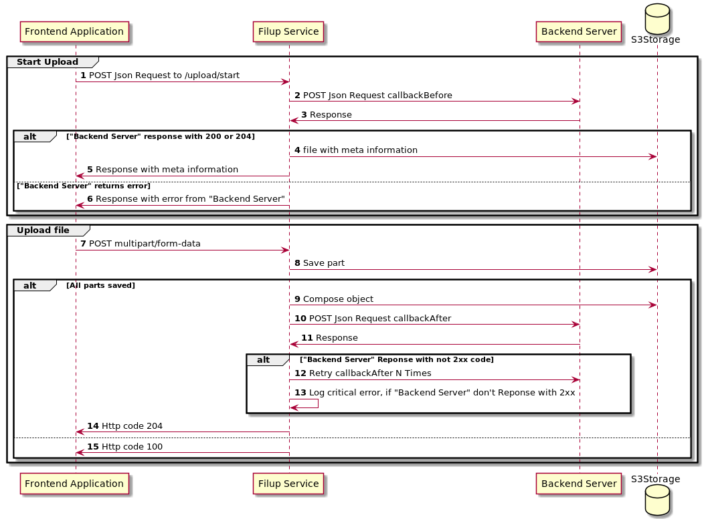

# FilUp

Upload big files directly to S3-compatible storage. Support chunked upload. Cloud native.

## Roadmap
v0.0.1 - base functions: upload files with multipart\form-data, callbacks, download files by uuid

v0.0.2 - add upload metrics

v0.0.3 - add upload by WebSockets

## Base upload flow



### Two phases of upload
#### Start upload
1. Frontend application make POST Json Request to `/upload/start` endpoint. In this request 
MUST BE the field with name, defined by `uploader.infoFieldName` config key (default is: `_uploader_info`). Under this filed MUST BE a integer field 
`file_size` with size of uploaded file in bytes. Also supports: string field `uuid` - if you wont generate uuid (filename) at frontend, and 
object of pair strings `user_tags` - if you need tagged file on storage. You can define any other fields and headers of request - they will passed on callbackBefore.

Sample request: 
```http request
POST http://localhost:8080/upload/start
Content-Type: application/json
Access-Token: qwiluergcnkrctmkaejr

{
  "_uploader_info": {
    "file_size": 60000000,
    "user_tags": {"tag": "test"}
  },
  "custom_info": {}
}
```

2. Filup make POST Request to `uploader.callbackBefore` with body and headers of request from (1). To body under `uploader.infoFieldName` will be added
`uuid` field with uuid of file (if it was not already there), and `chunks_info` - information about the chunks of the uploaded file
3. Backend server can check any information from request (for example - authorization) and response to filup with some HTTP code and body
4. If backend server response with 2xx code, Filup save some meta information in storage and
5. Response to frontend with meta information, such as `chunks_info`. Frontend application MUST send chunks with names and size from meta information.
6. If an error is received from backend server, it will be translated unchanged (same code and body)

#### Upload file
7. Frontend application make POST with multipart/form-data to `/upload/part` endpoint. Filename MUST BE from chunks meta information.
Sample request:
```http request
POST http://localhost:8080/upload/part
Content-Type: multipart/form-data; boundary=RaNdOmDeLiMiTeR

--RaNdOmDeLiMiTeR
Content-Disposition: form-data; name=part; filename="870915da-76bb-11ec-8686-e4e7494803df_part_0"

ojioeprtfoertfowerjtfioer,t;d,oersmvfylisdjr,fst;d,osfimbyjihldrtdk
dsfafdsfas
asdfadsfadsf
--RaNdOmDeLiMiTeR--
```
8. Filup save chunk, if name is correct, to storage'

9 - 14. Filup checks - if all chunks is uploaded, then storage compose object. Than Filup make POST JsonRequest with meta information (such as uuid) to `uploader.callbackAfter`. 
If backend don't response with 2xx code, there will be several retires (defined by `uploader.httpRetries`). Regardless of success repsponse from backend, to frontend 204 OK will be sent.

15. If not all chunks already uploaded - Http Code 100 will be sent to frontend.
